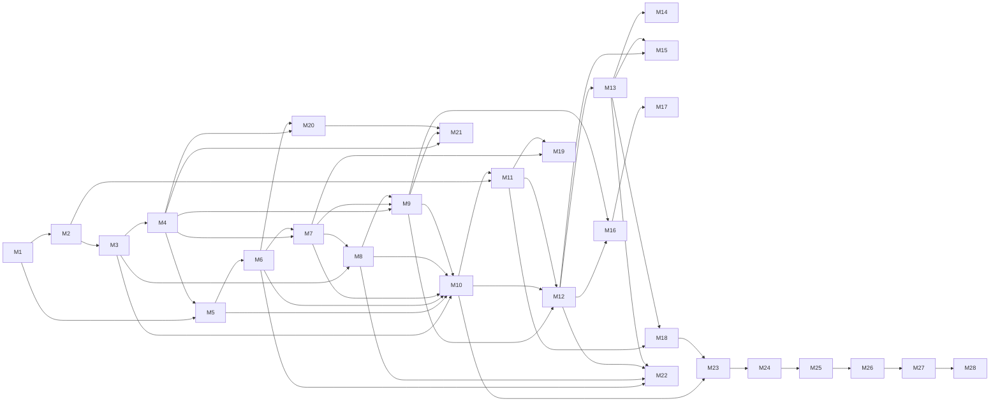

# Sentinel Twin — Project Execution Roadmap

## Operating model

This roadmap implements the autonomous EnergyPlus BMS described in `Implementation_Plan.md`. Manage each milestone as a GitHub Projects **epic**; create the listed GitHub issues as child issues. Every issue must have: owner, estimate, priority, dependency links, test evidence, and a link to its pull request. “Done” means merged, documented, and demonstrated—not merely coded.

**Planning assumption:** 2–3 developers, 50–65 focused engineering hours over two weeks. If time is constrained, complete milestones 1–18, 23, 25–28 before adding optional intelligence features 19–22.

**Priority key:** P0 = demo-critical; P1 = high-value; P2 = optional enhancement. Complexity: S/M/L.

---

## Milestone 1 — Development environment and engineering foundation

**Priority:** P0 · **Estimate:** 4 h · **Complexity:** M · **Dependencies:** none

### Goal
Create a reproducible Windows-first workspace for EnergyPlus, Python, the local Qwen endpoint, and the web dashboard.

### Why it matters
Unrepeatable environments are the most common source of hackathon integration failure.

### Deliverables / files / structure
- `README.md`, `.env.example`, `.gitignore`, `pyproject.toml`, `docker-compose.yml` (optional), `.github/workflows/ci.yml`.
- `configs/{development,building,policy}.yaml`; `scripts/{bootstrap,check_environment}.ps1`.
- Root folders: `apps/`, `packages/`, `models/`, `configs/`, `tests/`, `docs/`, `scripts/`, `data/`.

### APIs, classes, functions, data flow
Define shared configuration loading and `RunContext(run_id, scenario_id, timestamp)`. All processes read versioned configuration → attach run context → emit structured logs.

### Acceptance criteria / Definition of Done
Fresh clone plus documented setup completes environment checks; lint and a placeholder test run locally and in CI; secrets are excluded from Git.

### Testing checklist
- Clean-machine/bootstrap test; Python/package version check; EnergyPlus executable check; Qwen health endpoint check; frontend build check.

### GitHub issues / commits
- Issues: `Bootstrap repository`, `Pin toolchain and CI`, `Document local setup`.
- Commits: `chore: scaffold Sentinel Twin workspace`; `ci: add quality gate`.

### Risks, mistakes, nice-to-have
Risk: incompatible EnergyPlus/Python versions. Mitigate with pinned versions and a diagnostics script. Avoid committing models, output data, or API keys. Nice-to-have: dev container.

---

## Milestone 2 — EnergyPlus reference model and baseline

**Priority:** P0 · **Estimate:** 6 h · **Complexity:** L · **Dependencies:** M1

### Goal
Select, version, and validate one office reference model with weather, schedules, required output variables, and a repeatable baseline run.

### Deliverables / files / structure
- `models/energyplus/{building.epJSON,weather.epw,outputs.yaml,schedules/}`.
- `scripts/run_baseline.ps1`; `docs/model-assumptions.md`; `data/fixtures/baseline_manifest.json`.

### APIs, classes, functions, data flow
`EnergyPlusRunConfig`; `run_baseline(config)`; `validate_model_outputs(path)`. EPJSON + weather + schedule → EnergyPlus → SQL/CSV outputs → manifest.

### Acceptance criteria / Definition of Done
A fixed 24–72-hour scenario runs twice with matching outputs; zone temperature, HVAC energy, outdoor weather, occupancy proxy, and unmet-hours outputs exist.

### Testing checklist
- Model parse; weather path; expected output column contract; fixed-seed repeatability; failed-run diagnostic test.

### GitHub issues / commits
- `Choose and license reference model`, `Configure outputs`, `Establish baseline KPI artifact`.
- `feat(sim): add reproducible reference building baseline`.

### Risks, mistakes, nice-to-have
Risk: choosing too complex a model. Use a known medium office model. Do not change building and controller between comparison runs. Nice-to-have: second climate profile.

---

## Milestone 3 — Simulation API and actuator adapter

**Priority:** P0 · **Estimate:** 6 h · **Complexity:** L · **Dependencies:** M2

### Goal
Isolate EnergyPlus behind a stable adapter that can read outputs and apply safe actuator/schedule overrides.

### Deliverables / files / structure
- `packages/sim_adapter/{runner,parser,actuator,contracts}.py`; `tests/integration/test_sim_adapter.py`.
- `docs/actuation-contract.md`.

### APIs, classes, functions, data flow
`SimulationAdapter.run_step()`, `read_telemetry()`, `apply_action(ActionCommandV1)`, `acknowledge()`. EnergyPlus/plugin or generated schedules → adapter → normalized telemetry/action acknowledgement.

### Acceptance criteria / Definition of Done
One allowed setpoint command affects a later interval; invalid zone/actuator is rejected; acknowledgement is persisted.

### Testing checklist
- Parser fixture; command allow-list; manual safe override; rejected invalid action; simulator failure/timeout path.

### GitHub issues / commits
- `Create telemetry parser`, `Implement actuation gateway`, `Prove manual override`.
- `feat(sim): expose EnergyPlus telemetry and actuator contract`.

### Risks, mistakes, nice-to-have
Risk: live stepping is fragile. Keep a contract-compatible replay adapter. Never let UI or LLM write IDF/EPJSON directly. Nice-to-have: Python Plugin actuator path.

---

## Milestone 4 — Sensor pipeline and state builder

**Priority:** P0 · **Estimate:** 5 h · **Complexity:** M · **Dependencies:** M3

### Goal
Normalize simulation telemetry into trustworthy, occupancy-aware building state.

### Deliverables / files / structure
- `packages/{domain,state_engine}/{models,normalizer,quality,features}.py`.
- `configs/zone_map.yaml`; `docs/data-dictionary.md`.

### APIs, classes, functions, data flow
`TelemetryV1`, `BuildingStateV1`, `StateBuilder.build(events)`, `QualityFlagger.evaluate()`. Raw records → unit/zone normalization → quality flags/trends → state card.

### Acceptance criteria / Definition of Done
Every controlled zone has current/recent temperature, occupancy, comfort state, energy, forecast inputs, and data-quality status.

### Testing checklist
- Unit conversion; missing/stale value; duplicate timestamps; zone mapping; comfort trend calculation.

### GitHub issues / commits
- `Define domain schemas`, `Build normalized state`, `Add data-quality flags`.
- `feat(state): construct validated occupancy-aware building state`.

### Risks, mistakes, nice-to-have
Avoid passing raw CSV to the model. Nice-to-have: sensor trust score based on plausibility and freshness.

---

## Milestone 5 — Qwen local integration

**Priority:** P0 · **Estimate:** 4 h · **Complexity:** M · **Dependencies:** M1, M4

### Goal
Connect Qwen 3 14B to a reliable local, OpenAI-compatible inference client with health, latency, and failure handling.

### Deliverables / files / structure
- `packages/ai/{qwen_client,prompt_templates,schemas}.py`; `configs/llm.yaml`.

### APIs, classes, functions, data flow
`QwenClient.health()`, `complete_structured(prompt, schema)`, `DecisionProposalV1`. State card + invariant policy → local Qwen → schema-validated proposal or fail-closed error.

### Acceptance criteria / Definition of Done
Model returns a valid decision schema under the target local latency; timeout and malformed output cause `HOLD`.

### Testing checklist
- Health, JSON schema, timeout, malformed JSON, unavailable-model fallback, prompt token-budget test.

### GitHub issues / commits
- `Configure local Qwen client`, `Define decision response schema`, `Add fail-closed handling`.
- `feat(ai): add bounded local Qwen decision client`.

### Risks, mistakes, nice-to-have
Risk: 8GB VRAM latency. Use compact state cards, low temperature, short outputs, and only conditional critic calls. Do not swap the selected model. Nice-to-have: response cache for static policy context.

---

## Milestone 6 — AI tool calling and evidence retrieval

**Priority:** P0 · **Estimate:** 5 h · **Complexity:** M · **Dependencies:** M4, M5

### Goal
Give Qwen bounded read tools and an action-proposal tool; never direct actuation.

### Deliverables / files / structure
- `packages/ai/{tools,tool_router,policy_retrieval}.py`; `docs/tool-contracts.md`.

### APIs, classes, functions, data flow
`get_building_state`, `get_forecast`, `get_kpis`, `lookup_policy`, `simulate_candidate`, `propose_action`. Qwen plan → allow-listed tool calls → evidence IDs → candidate proposal.

### Acceptance criteria / Definition of Done
All tool calls are typed, logged, time-bounded, and restricted to read-only except `propose_action`.

### Testing checklist
- Unauthorized tool; invalid arguments; tool timeout; evidence ID propagation; action proposal cannot actuate.

### GitHub issues / commits
- `Implement evidence tools`, `Build allow-listed router`, `Log tool provenance`.
- `feat(ai): add auditable bounded tool calling`.

### Risks, mistakes, nice-to-have
Do not make filesystem/shell tools available. Nice-to-have: retrieval of similar prior episodes.

---

## Milestone 7 — Decision engine and deterministic policy

**Priority:** P0 · **Estimate:** 5 h · **Complexity:** L · **Dependencies:** M4, M6

### Goal
Implement a conservative deterministic controller and a decision graph that compares it with Qwen intent.

### Deliverables / files / structure
- `packages/control/{baseline_policy,decision_engine,objective}.py`; `configs/policy.yaml`.

### APIs, classes, functions, data flow
`BaselinePolicy.decide(state)`, `DecisionEngine.build_candidates()`, `DecisionV1`. State → baseline/AI candidates → objective/trade-off records → safety candidate queue.

### Acceptance criteria / Definition of Done
The platform makes a valid safe decision without Qwen, and Qwen can select only bounded intents/actions.

### Testing checklist
- Hot/cold/occupied/unoccupied states; no-change band; conflicting zones; Qwen abstention; deterministic fallback.

### GitHub issues / commits
- `Implement conservative baseline`, `Add candidate comparison`, `Record decision rationale`.
- `feat(control): add deterministic fallback and decision graph`.

### Risks, mistakes, nice-to-have
Avoid “AI wins by default.” Nice-to-have: conditional critic for low-confidence decisions.

---

## Milestone 8 — Safety layer and rollback

**Priority:** P0 · **Estimate:** 6 h · **Complexity:** L · **Dependencies:** M3, M7

### Goal
Create an independently testable Safety Kernel that validates, clips, rejects, verifies, and rolls back all actions.

### Deliverables / files / structure
- `packages/control/{safety_kernel,limits,rollback}.py`; `configs/safety_limits.yaml`; `docs/safety-policy.md`.

### APIs, classes, functions, data flow
`SafetyKernel.evaluate(candidate,state) -> ValidationResultV1`; `RollbackManager.restore()`. Candidate → schema/limits/dwell/comfort checks → accept/clip/reject → actuation → acknowledgement → rollback if needed.

### Acceptance criteria / Definition of Done
Unsafe action is demonstrably rejected; stale telemetry causes hold; missed acknowledgement restores safe baseline.

### Testing checklist
- Every hard bound; overlapping heat/cool; rate/dwell limit; stale telemetry; actuator error; rollback persistence.

### GitHub issues / commits
- `Encode safety constraints`, `Add rollback`, `Create safety boundary test suite`.
- `feat(safety): enforce independent action gate and rollback`.

### Risks, mistakes, nice-to-have
Never place safety only in prompt text. Nice-to-have: operator approval mode for medium-confidence actions.

---

## Milestone 9 — Decision memory and event store

**Priority:** P1 · **Estimate:** 4 h · **Complexity:** M · **Dependencies:** M4, M7, M8

### Goal
Persist replayable decisions, outcomes, memory summaries, and correlation IDs.

### Deliverables / files / structure
- `packages/persistence/{repositories,migrations,event_store}.py`; `packages/ai/memory.py`; `docs/event-schema.md`.

### APIs, classes, functions, data flow
`EventRepository.append()`, `find_similar_episodes()`, `record_outcome()`. Telemetry/decision/validation/action/outcome → SQLite event store → compact retrieval summary.

### Acceptance criteria / Definition of Done
Any decision ID reconstructs input state, evidence, verdict, action, and observed 60-minute outcome.

### Testing checklist
- Migration; correlation consistency; replay ordering; bounded retrieval; sensitive-log exclusion.

### GitHub issues / commits
- `Create event schema`, `Persist decision provenance`, `Implement episodic retrieval`.
- `feat(data): add replayable decision memory`.

### Risks, mistakes, nice-to-have
Avoid storing unlimited raw prompts/history. Nice-to-have: outcome-based confidence calibration.

---

## Milestone 10 — Closed-loop controller and shadow mode

**Priority:** P0 · **Estimate:** 6 h · **Complexity:** L · **Dependencies:** M3–M9

### Goal
Run the 30-minute observe → decide → validate → actuate → verify loop, initially in shadow mode.

### Deliverables / files / structure
- `apps/worker/{control_loop,orchestrator}.py`; `scripts/run_scenario.ps1`; `docs/operations-runbook.md`.

### APIs, classes, functions, data flow
`ControlLoop.tick()`, `run_shadow_mode()`, `run_autonomous_mode()`. Simulator → state → candidates → safety → command/hold → verification → event store.

### Acceptance criteria / Definition of Done
At least one full scenario completes with every decision traceable; shadow and autonomous modes are visibly distinct.

### Testing checklist
- End-to-end smoke; Qwen unavailable; simulator crash; delayed response; safe mode switch; repeated loop idempotency.

### GitHub issues / commits
- `Orchestrate control tick`, `Implement shadow mode`, `Add end-to-end smoke run`.
- `feat(loop): close validated supervisory control loop`.

### Risks, mistakes, nice-to-have
Risk: timing/integration instability. Keep replay adapter and deterministic fallback. Nice-to-have: pause/resume controls.

---

## Milestone 11 — Baseline-vs-AI evaluation

**Priority:** P0 · **Estimate:** 5 h · **Complexity:** M · **Dependencies:** M2, M10

### Goal
Produce fair, automatic comparison evidence for energy, comfort, cost, carbon, and operational safety.

### Deliverables / files / structure
- `packages/analytics/{kpis,comparison,reports}.py`; `configs/scenarios.yaml`; `docs/evaluation-protocol.md`.

### APIs, classes, functions, data flow
`KpiEngine.calculate(run)`, `compare_runs(baseline, ai)`, `generate_report()`. Matched runs → metrics → comparison artifact/plots/report.

### Acceptance criteria / Definition of Done
Normal, heatwave, occupancy-spike, and fault scenarios generate comparison reports with run manifests.

### Testing checklist
- Identical input manifest; metric formulas; missing series; expected direction fixture; report snapshot.

### GitHub issues / commits
- `Define fair evaluation protocol`, `Calculate KPIs`, `Generate daily report`.
- `feat(analytics): add reproducible baseline comparison`.

### Risks, mistakes, nice-to-have
Do not optimize against a changing baseline. Nice-to-have: Pareto comfort/energy frontier chart.

---

## Milestone 12 — Dashboard backend and live API

**Priority:** P0 · **Estimate:** 4 h · **Complexity:** M · **Dependencies:** M9, M10, M11

### Goal
Expose typed REST and WebSocket APIs for current state, events, KPIs, replay, and operator commands.

### Deliverables / files / structure
- `apps/api/{main,routes,websocket,dependencies}.py`; `docs/api-contract.md`.

### APIs, classes, functions, data flow
`GET /state`, `/kpis`, `/decisions`, `/replay`; `POST /override`, `/mode`; `WS /events`. Event store/control loop → API serializer → dashboard clients.

### Acceptance criteria / Definition of Done
Dashboard receives live events and all operator commands pass through Safety Kernel with audit records.

### Testing checklist
- OpenAPI contract; authorization stub; WebSocket reconnect; event ordering; invalid override rejected.

### GitHub issues / commits
- `Create FastAPI service`, `Stream control events`, `Expose replay endpoints`.
- `feat(api): serve typed operations and replay APIs`.

### Risks, mistakes, nice-to-have
Never let an endpoint bypass safety. Nice-to-have: server-sent audit export.

---

## Milestone 13 — Professional operator UI

**Priority:** P0 · **Estimate:** 6 h · **Complexity:** L · **Dependencies:** M12

### Goal
Build an executive-grade command center before adding 3D ornamentation.

### Deliverables / files / structure
- `apps/dashboard/{app,components,features,lib}`; design tokens and responsive layouts.

### APIs, classes, functions, data flow
`useLiveEvents`, `useBuildingState`, `OverridePanel`; state/KPI/alerts API → cached UI state → panels.

### Acceptance criteria / Definition of Done
Live operations rail, comfort, energy, alert drawer, mode state, baseline comparison, and override are readable on a laptop.

### Testing checklist
- Component/unit tests; mobile/laptop layout; loading/error state; keyboard control; override confirmation.

### GitHub issues / commits
- `Build application shell`, `Add KPI and comfort panels`, `Implement operator controls`.
- `feat(ui): deliver Sentinel Twin command center`.

### Risks, mistakes, nice-to-have
Avoid dense student-dashboard charts. Nice-to-have: dark/light presentation themes.

---

## Milestone 14 — 3D digital twin

**Priority:** P1 · **Estimate:** 5 h · **Complexity:** L · **Dependencies:** M13

### Goal
Add a legible simplified 3D floor/zone model with thermal and HVAC state animation.

### Deliverables / files / structure
- `apps/dashboard/features/twin3d/*`; `apps/dashboard/public/floorplan.json`.

### APIs, classes, functions, data flow
`TwinScene`, `ZoneMesh`, `ThermalLegend`; current state → zone color/airflow/equipment animation → selected-zone detail.

### Acceptance criteria / Definition of Done
All controlled zones map correctly and a spectator can interpret temperature, comfort, and HVAC state in under five seconds.

### Testing checklist
- Zone map contract; rendering fallback; low-performance mode; color accessibility; selected-zone synchronization.

### GitHub issues / commits
- `Model simplified floor`, `Bind zone telemetry`, `Add HVAC animations`.
- `feat(twin): visualize live zone thermal state`.

### Risks, mistakes, nice-to-have
Avoid photorealistic BIM scope. Nice-to-have: camera presets for demo scenes.

---

## Milestone 15 — Live telemetry and alerting

**Priority:** P1 · **Estimate:** 3 h · **Complexity:** M · **Dependencies:** M12, M13

### Goal
Make event freshness, health, and operational alerts obvious in real time.

### Deliverables / files / structure
- `packages/domain/alerts.py`; `apps/dashboard/features/alerts/*`.

### APIs/classes/functions/data flow
`AlertEngine.evaluate(event)`, `AlertV1`; event stream → rule/priority → WebSocket → alert drawer/acknowledgement.

### Acceptance criteria / testing / issues / commits
Stale data, high discomfort, rejected action, and actuator failure show distinct severity and links to decision ID. Test dedupe, acknowledgement, reconnect, and alert clearing. Issues: `Define alert policy`, `Stream alerts`, `Render alert drawer`. Commit: `feat(ops): add live health and alerting`.

### Risks, mistakes, nice-to-have
Alert fatigue is a risk; deduplicate and rank. Nice-to-have: audible demo alert (off by default).

---

## Milestone 16 — AI decision timeline

**Priority:** P0 · **Estimate:** 4 h · **Complexity:** M · **Dependencies:** M9, M12, M13

### Goal
Show evidence, candidate options, prediction, safety verdict, action, confidence, and observed result without exposing chain-of-thought.

### Deliverables / files / structure
- `apps/dashboard/features/decisions/*`; `docs/decision-explanation-policy.md`.

### APIs/classes/functions/data flow
`DecisionTimeline`, `DecisionCard`, `getDecision(id)`; decision events → concise rationale/provenance → expandable card.

### Acceptance criteria / testing / issues / commits
Every action and rejection has an intelligible timeline card. Test missing evidence, long rationale truncation, outcome attachment, and color/status accessibility. Issues: `Create timeline API view`, `Build decision cards`, `Attach outcomes`. Commit: `feat(ui): visualize audited AI decisions`.

### Risks, mistakes, nice-to-have
Avoid fake “reasoning.” Display factual observations and policy result. Nice-to-have: one-click incident export.

---

## Milestone 17 — Historical replay

**Priority:** P1 · **Estimate:** 4 h · **Complexity:** M · **Dependencies:** M9, M12, M16

### Goal
Enable scrubbing a run to explain past state and control decisions.

### Deliverables / files / structure
- `apps/dashboard/features/replay/*`; `packages/analytics/replay.py`.

### APIs/classes/functions/data flow
`ReplayService.frame_at()`, `ReplayController`; ordered event store → timestamp frame → all dashboard panels.

### Acceptance criteria / testing / issues / commits
Replay selects a timestamp and synchronizes 3D, charts, state, and decision card. Test sparse intervals, fast scrub, timeline boundaries, and live/replay mode isolation. Issues: `Create replay aggregation`, `Build scrubber`, `Synchronize panels`. Commit: `feat(replay): add time-travel operations review`.

### Risks, mistakes, nice-to-have
Risk: expensive queries; pre-aggregate frames. Nice-to-have: side-by-side baseline replay.

---

## Milestone 18 — Analytics and executive reporting

**Priority:** P0 · **Estimate:** 4 h · **Complexity:** M · **Dependencies:** M11, M13

### Goal
Turn raw metrics into convincing reports and dashboard narratives.

### Deliverables / files / structure
- `apps/dashboard/features/analytics/*`; `docs/report-interpretation.md`.

### APIs/classes/functions/data flow
`SavingsCard`, `ComfortDebtChart`, `ParetoChart`; KPI artifacts → aggregation → charts/report.

### Acceptance criteria / testing / issues / commits
Report answers “saved what, at what comfort cost, with what confidence?” Test zero baseline, negative savings, unit display, chart snapshots. Issues: `Build KPI cards`, `Add comfort-energy comparison`, `Publish report export`. Commit: `feat(analytics): present outcome and trade-off evidence`.

### Risks, mistakes, nice-to-have
Avoid cherry-picked chart windows. Nice-to-have: cost and carbon equivalents understandable to non-engineers.

---

## Milestone 19 — Carbon and tariff optimization

**Priority:** P1 · **Estimate:** 4 h · **Complexity:** M · **Dependencies:** M7, M11

### Goal
Allow bounded preconditioning and load shifting when forecast carbon/price benefit does not create comfort debt.

### Deliverables / files / structure
- `packages/control/{carbon_policy,tariff}.py`; `configs/carbon_profile.yaml`.

### APIs/classes/functions/data flow
`CarbonSignal`, `CarbonAwareObjective.score()`; forecast → objective weighting → candidate ranking → safety gate.

### Acceptance criteria / testing / issues / commits
Carbon/price signal changes candidate ranking but never overrides comfort limits. Test flat/missing/noisy signals and threshold cases. Issues: `Add carbon profile`, `Score carbon-aware candidates`, `Report avoided CO2e`. Commit: `feat(control): support carbon-aware thermal shifting`.

### Risks, mistakes, nice-to-have
Clearly label simulated/static grid data. Nice-to-have: forecast confidence weighting.

---

## Milestone 20 — Weather forecast integration

**Priority:** P1 · **Estimate:** 3 h · **Complexity:** M · **Dependencies:** M4, M6

### Goal
Supply forecasted outdoor conditions as confidence-scored control evidence.

### Deliverables / files / structure
- `packages/state_engine/weather.py`; `configs/weather.yaml`.

### APIs/classes/functions/data flow
`WeatherProvider.get_forecast()`, `ForecastV1`; EPW/replay forecast → quality/confidence → state/tool → decision.

### Acceptance criteria / testing / issues / commits
The controller handles unavailable/biased forecast by holding or reducing aggressiveness. Test missing, stale, extreme, and offset forecasts. Issues: `Implement weather provider`, `Add forecast quality`, `Expose weather tool`. Commit: `feat(state): add resilient weather forecast evidence`.

### Risks, mistakes, nice-to-have
Avoid making live internet a demo dependency. Nice-to-have: forecast-error scenario.

---

## Milestone 21 — Occupancy prediction and Comfort Debt

**Priority:** P1 · **Estimate:** 4 h · **Complexity:** M · **Dependencies:** M4, M9, M20

### Goal
Predict near-term occupancy from schedules and prioritize occupied comfort fairly using a Comfort Debt Ledger.

### Deliverables / files / structure
- `packages/state_engine/{occupancy,comfort_debt}.py`; `configs/occupancy.yaml`.

### APIs/classes/functions/data flow
`OccupancyForecaster.predict()`, `ComfortDebtLedger.update()`; schedules/history → occupancy confidence/debt → objective/state/UI.

### Acceptance criteria / testing / issues / commits
Meeting spike produces proactive but bounded conditioning; ledger increases only for occupied discomfort and decays transparently. Test unoccupied zone, schedule conflict, spike, and reset. Issues: `Build occupancy predictor`, `Implement debt ledger`, `Surface fairness metric`. Commit: `feat(comfort): prioritize occupancy-weighted comfort debt`.

### Risks, mistakes, nice-to-have
Avoid pretending occupancy is measured precisely. Nice-to-have: privacy-preserving aggregate occupancy labels.

---

## Milestone 22 — Natural-language operator interface

**Priority:** P2 · **Estimate:** 4 h · **Complexity:** M · **Dependencies:** M6, M8, M12, M13

### Goal
Let an operator ask for status/explanations and request constrained overrides through the same Safety Kernel.

### Deliverables / files / structure
- `apps/dashboard/features/operator_assistant/*`; `packages/ai/operator_tools.py`.

### APIs/classes/functions/data flow
`OperatorIntentParser`, `request_override`; operator text → intent/clarification → proposed command → safety/confirmation → audit.

### Acceptance criteria / testing / issues / commits
Read questions cite decision IDs; control requests require confirmation and cannot bypass policy. Test prompt injection, ambiguous zone, unsafe request, and audit log. Issues: `Add read-only operator queries`, `Gate override requests`, `Add confirmation UI`. Commit: `feat(operator): add safety-gated natural language operations`.

### Risks, mistakes, nice-to-have
Do not position chat as the controller. Nice-to-have: generated handover summary.

---

## Milestone 23 — System testing and resilience

**Priority:** P0 · **Estimate:** 6 h · **Complexity:** L · **Dependencies:** M10–M18 (and feature milestones selected)

### Goal
Verify the entire system under normal and fault conditions with demonstrable evidence.

### Deliverables / files / structure
- `tests/{unit,contract,integration,scenarios,e2e}`; `docs/test-plan.md`; CI artifacts.

### APIs/classes/functions/data flow
`ScenarioRunner.run()`, `FaultInjector.inject()`; scenario/fault → full stack → assertions/artifacts.

### Acceptance criteria / testing / issues / commits
Pass all safety boundary tests, API contracts, loop smoke, dashboard E2E, and fault cases: LLM timeout, malformed proposal, stale telemetry, actuator error, bad sensor, comfort violation. Issues: `Create fault matrix`, `Automate E2E suite`, `Publish test evidence`. Commit: `test: verify safety and end-to-end resilience`.

### Risks, mistakes, nice-to-have
Avoid only happy-path tests. Nice-to-have: nightly scenario matrix in CI.

---

## Milestone 24 — Performance and demo reliability

**Priority:** P1 · **Estimate:** 4 h · **Complexity:** M · **Dependencies:** M10, M12–M18, M23

### Goal
Meet demo latency targets and make every presentation path robust.

### Deliverables / files / structure
- `docs/performance-budget.md`; `scripts/demo_preflight.ps1`; cached replay artifacts.

### APIs/classes/functions/data flow
`HealthAggregator`, `DemoPreflight.run()`; process health/latency → go/no-go report; cache → dashboard replay fallback.

### Acceptance criteria / testing / issues / commits
State update <2s locally, dashboard update <1s, Qwen bounded timeout, and replay demo works offline. Test cold start, network disabled, model timeout, browser refresh. Issues: `Profile control loop`, `Add preflight`, `Create offline replay fallback`. Commit: `perf: harden live demo and replay fallback`.

### Risks, mistakes, nice-to-have
Avoid relying on model warm-up during judging. Nice-to-have: record a deterministic backup run.

---

## Milestone 25 — Documentation and runbooks

**Priority:** P0 · **Estimate:** 4 h · **Complexity:** M · **Dependencies:** M1–M24

### Goal
Make the project credible, reproducible, and operable by someone other than its authors.

### Deliverables / files / structure
- `README.md`; `docs/{architecture,setup,runbook,safety-policy,evaluation,demo-script,adrs}/`.

### APIs/classes/functions/data flow
Document real contracts, configuration, event fields, operation modes, failure actions, and report interpretation.

### Acceptance criteria / testing / issues / commits
A new teammate can set up, run baseline, run AI scenario, interpret report, and execute rollback from docs. Test with a clean-reader walkthrough. Issues: `Write setup guide`, `Write safety/runbook`, `Publish architecture and ADRs`. Commit: `docs: complete operator and engineering handoff`.

### Risks, mistakes, nice-to-have
Do not document aspirational features as shipped. Nice-to-have: 90-second architecture video/GIF.

---

## Milestone 26 — Presentation package

**Priority:** P0 · **Estimate:** 4 h · **Complexity:** M · **Dependencies:** M11, M13, M16, M18, M25

### Goal
Create a judge-oriented story: problem, differentiator, proof, trust, and impact.

### Deliverables / files / structure
- `docs/presentation/{outline,slides,judge-faq}.md`; screenshot/video assets.

### APIs/classes/functions/data flow
No product API; source every claim from immutable run/report artifacts.

### Acceptance criteria / testing / issues / commits
Five-minute delivery covers live loop, counterfactual rejection, comfort-energy evidence, and operator control. Rehearse to time with a non-author. Issues: `Draft story`, `Create evidence slides`, `Prepare judge questions`. Commit: `docs: add final judging presentation`.

### Risks, mistakes, nice-to-have
Avoid feature inventory slides. Nice-to-have: one architecture animation.

---

## Milestone 27 — Demo recording and rehearsal

**Priority:** P0 · **Estimate:** 3 h · **Complexity:** M · **Dependencies:** M23–M26

### Goal
Produce a clean backup recording and rehearse the live hero scenario/fallbacks.

### Deliverables / files / structure
- `docs/demo/{cue-sheet,reset-runbook}.md`; recorded demo asset; seeded scenario configuration.

### APIs/classes/functions/data flow
Demo setup → seeded scenario → live/replay command center → report close.

### Acceptance criteria / testing / issues / commits
Two complete rehearsals succeed; recording has clear legible resolution/audio; reset path works in under five minutes. Issues: `Seed hero disturbance`, `Record backup demo`, `Run failure rehearsal`. Commit: `chore: package reproducible demo scenario`.

### Risks, mistakes, nice-to-have
Risk: live system timing differs. Use known deterministic event timing and an offline replay. Nice-to-have: captions.

---

## Milestone 28 — Final submission and release

**Priority:** P0 · **Estimate:** 3 h · **Complexity:** S · **Dependencies:** M25–M27

### Goal
Freeze a verified release, submit all required artifacts, and preserve reproducibility.

### Deliverables / files / structure
- Release tag; submission README; architecture/evaluation/demo links; immutable report and configuration manifests.

### APIs/classes/functions/data flow
Release candidate → preflight/tests → tag/package → submission portal/repository.

### Acceptance criteria / testing / issues / commits
Clean clone/release check passes; all links render; submission requirements checked by two people; final tag is recoverable. Issues: `Run release checklist`, `Verify submission artifacts`, `Tag final release`. Commit: `release: sentinel-twin hackathon submission`.

### Risks, mistakes, nice-to-have
Avoid last-minute feature merges. Nice-to-have: public architecture overview after judging rules permit it.

---

## Dependency graph

## Critical path

**M1 → M2 → M3 → M4 → M5/M6 → M7 → M8 → M9 → M10 → M11 → M12 → M13 → M16 → M18 → M23 → M24 → M25 → M26 → M27 → M28.**

Do not delay M3, M8, M10, or M11: they establish the evidence judges will score. M14, M15, M17, and M19–M22 may proceed in parallel or be cut without compromising the core claim.

## Recommended Git branching strategy

- Protect `main`: pull request, passing CI, and one reviewer required; tags only from `main`.
- Create short-lived branches: `feat/m03-sim-adapter`, `feat/m08-safety-kernel`, `fix/...`, `docs/...`.
- Integrate vertical slices early; avoid a long-lived frontend/backend split branch.
- Use conventional commits and squash merge one issue/one coherent change.
- Cut `release/demo-candidate` only during final stabilization; accept P0 bug fixes only, then tag `v1.0.0`.
- Record issue number in branch/PR title and attach test screenshots/reports to PRs.

## Weekly development schedule

| Day | Primary work | Parallel work | Gate |
|---|---|---|---|
| 1 | M1, M2 | model research/configuration | reproducible baseline |
| 2 | M3, M4 | domain schemas | manual action changes simulation |
| 3 | M5, M6, M7 | UI shell/design tokens | valid structured AI proposal |
| 4 | M8, M9, M10 | M11 evaluation framework | unsafe action rejected; full loop |
| 5 | M11, M12, M13 | M20/M21 if capacity | fair KPI report + live UI |
| 6 | M16, M18 | M14/M15/M17 | decision story understandable |
| 7 | M19–M22 selectively | M23 fault suite | feature freeze decision |
| 8 | M23, M24, M25 | demo scenario seed | release candidate reliable |
| 9 | M26, M27 | evidence polish | two successful rehearsals |
| 10 | M28 | contingency only | tagged submission |

## Risk register

| Risk | Likelihood / impact | Early indicator | Mitigation | Owner |
|---|---|---|---|---|
| EnergyPlus live actuation fails | M / H | manual override does not change output | prove M3 on Day 2; use replay adapter fallback | simulation lead |
| Qwen latency/OOM | M / H | missed control deadline | compact prompts, low concurrency, warm model, deterministic fallback | AI lead |
| Savings harm comfort | M / H | unmet hours rise | hard safety bounds, comfort debt, counterfactual gate, matched metrics | control lead |
| AI appears cosmetic | M / H | no evidence/candidate trace | tool provenance, shadow mode, decision timeline, rejected candidate demo | AI/product lead |
| Dashboard consumes schedule | H / M | core loop incomplete by Day 4 | UI begins only after API contract; cut 3D before safety/evaluation | frontend lead |
| Demo/internet failure | M / H | external dependency required | local assets, preflight, offline replay/recording | demo owner |
| Unfair baseline comparison | M / H | configs differ | immutable run manifests and automated comparison | analytics lead |
| Merge conflicts/regressions | M / M | large PRs/unstable main | short branches, contracts, CI, daily integration | project lead |

## Final project Definition of Done

- [ ] A fresh clone follows documented setup and launches the system.
- [ ] A versioned EnergyPlus baseline and autonomous scenario run from pinned configurations.
- [ ] Telemetry reaches normalized building state; state quality is visible.
- [ ] Qwen 3 14B uses bounded tools and returns validated structured decisions or abstains.
- [ ] No AI/UI path bypasses the independent Safety Kernel.
- [ ] Actions are acknowledged, verified, logged, and can roll back automatically.
- [ ] Decision Replay reconstructs state, evidence, safety result, action, and outcome.
- [ ] Matched evaluation proves energy, comfort, cost, carbon, and operational outcomes.
- [ ] The command center shows live/replay state, alerts, KPI results, decision timeline, and human override.
- [ ] Safety, API, control-loop, dashboard, and fault-injection tests pass in CI/local release check.
- [ ] Documentation, five-minute demo script, backup recording, and release tag are complete.
- [ ] No open P0/P1 defects; all claims in the presentation trace to stored artifacts.
