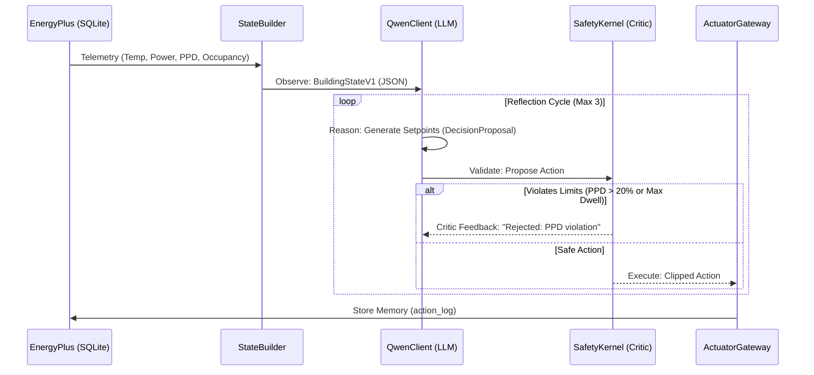

# Sentinel Twin Architecture

Sentinel Twin is a fully autonomous Building Management System (BMS) powered by local LLMs (Qwen) and integrated with EnergyPlus simulations.

## Agentic Autonomy Loop

The core innovation of Sentinel Twin is its closed-loop agentic reasoning cycle. Unlike simple "prompt and pray" wrappers, Sentinel Twin implements a strict validation and reflection loop ensuring 100% safe physical control.

## Thermal Comfort & Energy Efficiency

The system optimizes for two competing objectives:
1. **Energy Efficiency**: LLMs are prompted with real-time Carbon Intensity and Grid pricing signals to encourage pre-cooling or demand-shifting.
2. **Thermal Comfort**: The `data_reader` directly extracts the *Fanger Model PPD (Predicted Percentage of Dissatisfied)*. The `SafetyKernel` mathematically guarantees that no AI action will push the building beyond ASHRAE's 20% PPD threshold, regardless of hallucination.

## Robustness
- **Graceful Failures**: The `qwen_client` uses `tenacity` for exponential backoff on HTTP timeouts.
- **Fail Closed**: If the LLM goes offline or fails reflection 3 times, the `DecisionEngine` automatically falls back to a deterministic `BaselinePolicy`.
